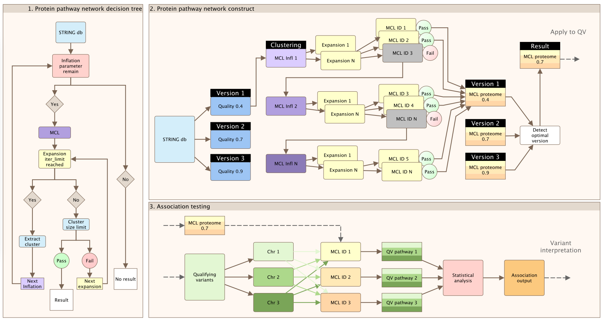

## Description

**__ProteoMCLustR__**

***P***roteome clustering with ***MCL*** algoritm in ***R***.

A tool for clustering and analyzing protein-protein interactions using the MCL algorithm.

Figure 1. Workflow illustration.

Th algorithmic description is as follows:

$\textbf{Input:}$
* $N_i, \ i = 1, \dots, n: \text{Nodes (genes) in the STRING database}$
* $E_{ij}, \ i, j = 1, \dots, n: \text{Edges (interactions) between nodes in STRING database}$
* $S: \text{Score threshold for edges}$
* $I: \text{Iteration limit}$
* $L_{min}, L_{max}: \text{Size limits for clusters}$
* $e, r: \text{Expansion and inflation parameters for MCL algorithm}$

$\textbf{Algorithm:}$
1. Preprocess:
$(N_i, E_{ij}, S) \rightarrow (N_i, E_{ij})$

2. ChooseInflation: 
$(N'_i, E'_{ij}, L_{min}, L_{max}) \rightarrow \text{inflation}$

3. RunMCL: 
$(N'_i, E'_{ij}, I, L_{min}, L_{max}, \text{inflation}, e, r)$

3.1. Initialize: 
$M^{(0)}_{ij} = \frac{E'_{ij}}{\sum_{k=1}^{n} E'_{ik}}$

3.2. Iterate until convergence:

3.2.1. Expansion: 
$M^{(k)} = (M^{(k-1)})^e$

3.2.2. Inflation: 
$M^{(k)}_{ij} = \frac{(M^{(k-1)}_{ij})^r}{\sum_{k=1}^{n} (M^{(k-1)}_{ik})^r}$

3.3. Extract clusters from converged matrix: 
$M^{(final)}$

$\textbf{Output:}$
$\text{Clusters: Set of optimized node (gene) clusters}$

where  $k$ is the index variable used in the iterative steps of the MCL algorithm, representing the iteration number.
Node indices in the graph are represented by $i$, $j$. In the context of the adjacency matrix or the stochastic matrix, $i$ represents the row index and $j$ represents the column index.
$M^{(k)}{ij}$ represents the element of the stochastic matrix $M^{(k)}$ at the $i$-th row and $j$-th column, representing the probability of transitioning from node $i$ to node $j$ during a random walk on the graph at the $k$-th iteration of the MCL algorithm.
$M^{(0)}{ij}$ represents the initial stochastic matrix.

## ProteoMCLustR

We have designed the ProteoMCLustR method to allow unbiased testing withing protein pathways. 
It combines the Markov Cluster Algorithm (MCL), a protein-protein interaction (PPI) database (such as STRINGdb), and customizable parameters tailored to the biological scenario (e.g., PPI evidence score and biological pathway size limits). The ProteoMCLustR approach constructs whole-genome protein pathways based on an external database, enabling a comprehensive understanding of biological networks while considering their complexity and specificity. The algorithm is less prone to bias during subsequent statistical analysis, as it performs network clustering independently of the test data.

To provide context, we deisnged this so that the subsequent testing can collapse the genotype matrix for a cohort into one variant set per protein pathway generated by the ProteoMCLustR method. We then perform a case-control analysis using the Variant Set Association Test (VSAT) with SKAT-O. This allows us to analyze every protein pathway genome-wide, facilitating a comprehensive investigation of biological networks. 
The ProteoMCLustR protocol is summarized in **Figure 1** and consists of the following major steps:

1. Set the `file_suffix` variable and redirect R output to a log file using the `sink` function.
2. Load the required packages, including `STRINGdb`, `parallel`, `dplyr`, and `ggplot2`.
3. Connect to the STRING database (version 11.5) using a specified score threshold and save the data as an RDS file, creating a `STRINGdb` object.
4. Read protein information from the file, selecting the relevant STRING ID and Gene ID columns, to create a data frame called `string_id_df`.
5. Define the `GetSubNetwork` function, which extracts a subnetwork from the STRING database by iterating over a set of protein IDs.
6. Define the `ChooseInflation` function, which finds the optimal MCL inflation parameter for clustering a given subnetwork by iterating over a set of inflation parameters (`mcl_inflation_param`). This function uses the `cluster_markov` function from the SoloTonic package and runs MCL clustering in parallel for different inflation parameters.
7. Define the `RunMCL` function, which recursively runs MCL clustering on a subnetwork using the `ChooseInflation` function. The recursion continues until a certain iteration limit (`iter_limit`) or cluster size limit (`size_limits`) is reached. If a cluster exceeds the size limit, the function recursively calls itself on the overlimit clusters.
8. Run the `RunMCL` function on the whole genome using the `string_id_df` data frame.
9. Recode the STRING IDs to gene IDs, creating `mcl_clusters_recode`, and save the clustering results to RDS files.
10. Generate a data frame from the clustering results, where each row represents a gene and its corresponding pathway ID.
11. Group the rows by pathway ID and count the number of genes in each pathway. Plot the counts using ggplot2 and save the plots as PDF files.
12. Check for overlaps between the groups by generating all possible combinations of two groups, counting the number of shared genes in each pair, and creating a data frame with overlap counts.

The MCL algorithm is a graph clustering technique that identifies clusters in an input matrix by iteratively applying expansion and inflation steps until the matrix converges to a stable state. The custom `RunMCL` function uses an `iter_limit` parameter to control the depth of recursive calls and `size_limits` to manage cluster size. If a cluster exceeds the specified `size_limits`, the script re-runs the MCL algorithm on that specific large cluster with an adjusted inflation parameter

## Set up
Rscript -e "usethis::create_package(getwd())"

## Docs with 
Rscript -e "devtools::document()"

## Build and install

Rscript -e "devtools::install()"

## License
Currently restrcited to: CC BY-NC-ND 4.0

License will be opened in future version when pending features are complete.

